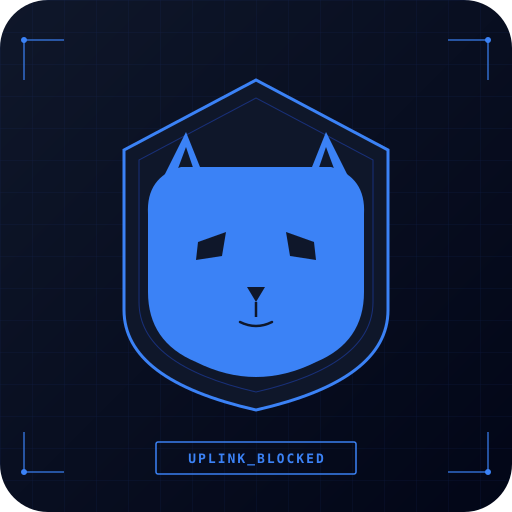
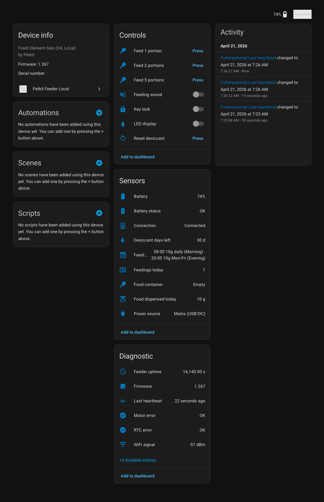
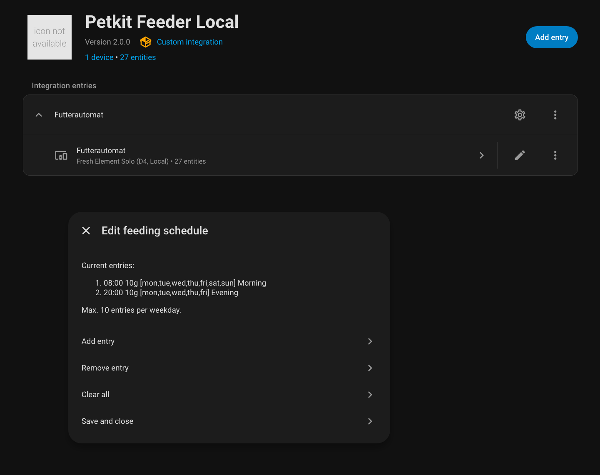
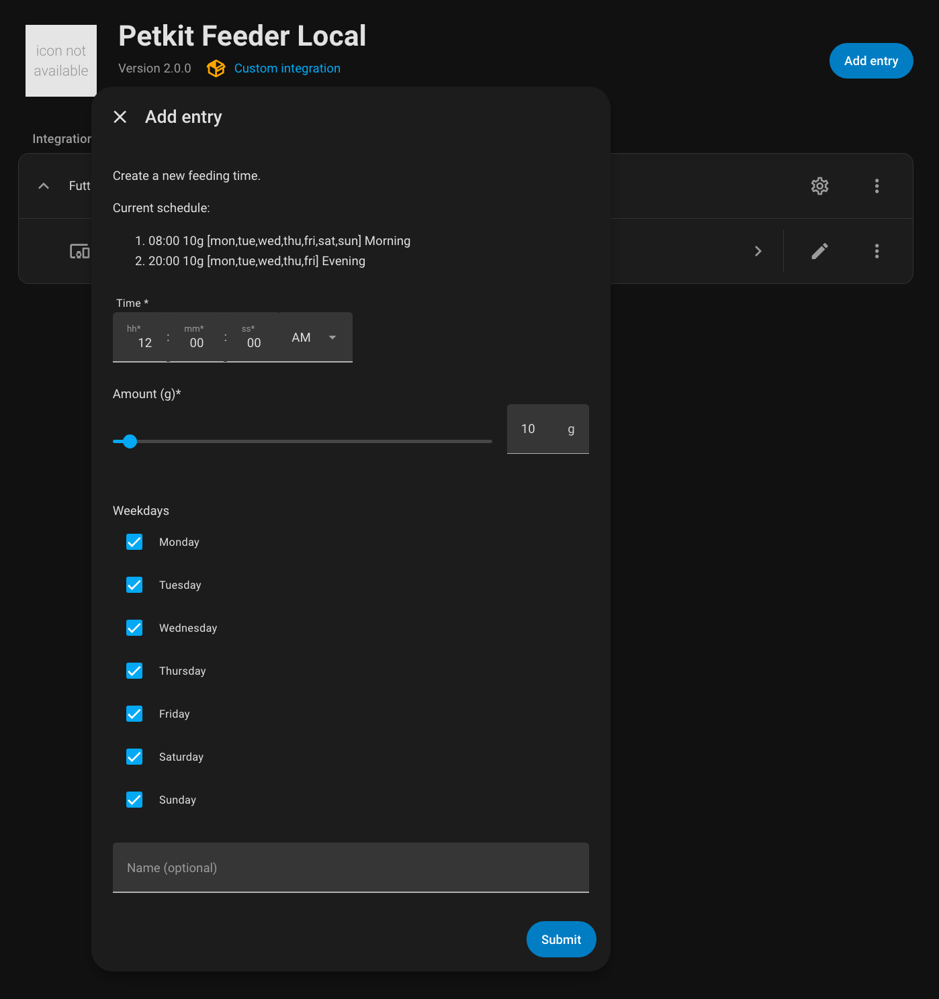
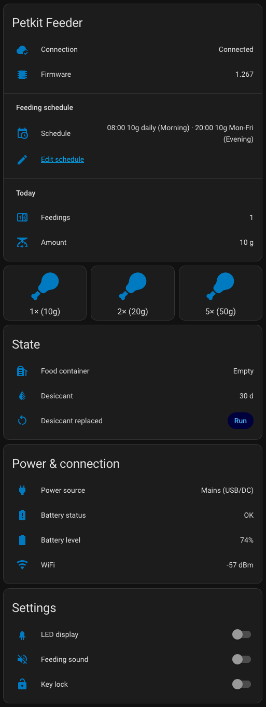

<p align="center">
  
</p>

<h1 align="center">Petkit Feeder Local</h1>

<p align="center">
  <em>A fully local Home Assistant integration for the Petkit Fresh Element Solo (D4) feeder.<br>
  Zero bytes sent to Petkit. Zero cloud dependency. Zero telemetry to China.</em>
</p>

<p align="center">
  <a href="#features"></a>
  
  
  
</p>

---

## Why does this exist?

Petkit's Fresh Element Solo is a decent smart feeder, but it phones home
constantly: heartbeats every 11 seconds over plaintext HTTP to
`api.eu-pet.com`, permanent MQTT session to
`eu-central-prod.mqtt.iotgds.aliyuncs.com` (Alibaba Cloud), and a mobile
app that demands location permission just to read your WiFi SSID.

It also has [real security issues](SECURITY.md) — unauthenticated
remote command execution, no TLS, no integrity checks on BLE
provisioning. If you can intercept the HTTP traffic, you can control the
feeder.

So: **we replaced the cloud with a local Home Assistant integration** that
reimplements just enough of the D4 protocol to keep the feeder happy while
never sending a single byte to Petkit or Alibaba.

## Scale of the problem

What happens when you don't intercept:

- **Heartbeats** every ~11 seconds → ~8,000 per device per day
- **State reports** every ~14 minutes → ~100 per device per day
- Combined payload: **~850 KB / day / device** to Petkit + Alibaba Cloud
- Conservatively 5–10 million Petkit devices deployed globally →
  **1.5–3 petabytes per year of pet-feeder telemetry**, mostly stating
  the fact that the feeder is online

The volume isn't even the scary part — it's what the payloads contain:

| Field | What it leaks |
|---|---|
| `ssid`, `bssid` | Your WiFi name + router MAC → **geolocation to ~10 m via WiGLE / Apple / Google WPS databases** |
| Timestamps of every feed | Daily rhythm, work schedule, vacation detection |
| `rsq` (WiFi RSSI) | Movement / device placement inference |
| Multiple Petkit devices on same SSID | Household topology reconstruction |
| `runtime`, firmware version | Power-outage patterns, update status |

None of this is needed for the feeder to work. This project proves it —
the unit runs indefinitely without any of that data leaving the house.

## Features

- 📅 **Feeding schedule** — up to 10 entries per weekday, managed from HA's UI
- 🍽️ **Manual feeding** — buttons / service for on-demand dispensing
- 🔋 **Battery monitoring** — level in %, voltage in mV (diagnostic), power source (mains vs. battery)
- 🏠 **Full device state** — food container, desiccant timer, WiFi signal, firmware version
- 🚨 **Error detection** — motor error, RTC error, IR sensor, DC errors as binary sensors
- 💾 **Persistent** — schedule and device state survive HA restarts
- 🌍 **Internationalization** — English + German out of the box, others via PR
- 🔒 **Zero cloud** — the feeder never reaches `api.eu-pet.com` or `aliyuncs.com` once configured

## Screenshots

<p align="center">
  <br>
  <sub><em>The full device view — controls, sensors, and diagnostic entities, all grouped natively in HA.</em></sub>
</p>

<br>

<table align="center">
  <tr>
    <td align="center" width="50%">
      <br>
      <sub><em>Options flow — manage the feeding plan.</em></sub>
    </td>
    <td align="center" width="50%">
      <br>
      <sub><em>Add-entry form with time picker, gram slider, weekdays.</em></sub>
    </td>
  </tr>
</table>

<br>

<p align="center">
  <br>
  <sub><em>Optional Lovelace card — drop-in YAML in <a href="docs/dashboard_card.yaml"><code>docs/dashboard_card.yaml</code></a>.</em></sub>
</p>

## How it works

```
  ┌───────────────────┐                      ┌──────────────────────┐
  │  Petkit Fresh     │                      │   Home Assistant     │
  │  Element Solo     │ ── HTTP (port 80) ─► │   custom_component   │
  │  (D4, FW 1.267)   │ ◄── responses ────── │   emulates cloud     │
  └───────────────────┘                      └──────────────────────┘
          ▲                                            │
          │                                            ▼
    Feeder is provisioned                    Feed commands,
    via BLE to point at                      schedule, settings,
    your HA server (port 80)                 error monitoring
```

The feeder is redirected — via a one-time BLE provisioning, or via a
DNS override — to a local HTTP server inside your Home Assistant. That
server implements just enough of the Petkit cloud API to keep the
feeder happy: heartbeats, device registration, schedule delivery, event
reporting, and command pushes.

## Supported devices

This integration is built and tested for the following Petkit feeder:

### Tested ✅

- **Petkit Fresh Element Solo (D4)**, firmware `1.267` — full feature support

### Likely compatible for feeding, NOT for video (untested on our end)

These feeders speak the same `/d4/` protocol — feeding schedule, battery,
heartbeats, everything non-video works exactly the same:

- **Petkit YumShare Solo** — feeding ✅, camera ❌
- **Petkit YumShare Dual-Hopper** — feeding ✅ (two-hopper logic untested), camera ❌

**Why no camera:** Petkit routes video via **Agora.io** (a commercial
WebRTC-SaaS, Chinese infrastructure) with server-side signed tokens.
This is a fundamentally different architecture than the plain HTTP we
intercept — there is no DNS redirect or local proxy that can replace
Agora's signed session broker without access to Petkit's private keys.
An existing integration
([Jezza34000/homeassistant_petkit](https://github.com/Jezza34000/homeassistant_petkit))
does expose YumShare video in Home Assistant, but the stream physically
still transits Petkit + Agora cloud infrastructure — it is not local.
If you're a privacy-focused user, that defeats the purpose.

**Privacy-respecting alternative:** Fresh Element Solo + a separate
ONVIF camera (Reolink E1, Tapo C200, anything with RTSP) + Frigate.
Costs about the same as a YumShare, gives you 100% local AI monitoring,
and lets you replace the camera later independently of the feeder.

### Not compatible ❌

- Petkit Mate D2 / D3 — different protocol, different endpoints
- Any Petkit device where the primary function is the camera (Cozy
  Cam, Cyber pet cameras etc.) — they speak Agora, not D4

## Installation

### Requirements

- Home Assistant 2024.1 or newer
- A Petkit D4-family feeder
- Ability to run Home Assistant on **port 80** (see
  [below](#port-80-and-home-assistant))
- A way to redirect the feeder's DNS or IP for `api.eu-pet.com` to your
  Home Assistant (see [below](#network-setup))

### 1. Install the integration

**Via HACS (recommended once merged):**
1. HACS → Integrations → ⋮ → Custom repositories
2. Add `https://github.com/Opcodeffm/petkit-feeder-local`, category *Integration*
3. Install *Petkit Feeder Local*, restart HA

**Manually:**
1. Copy `custom_components/petkit_feeder/` to your `config/custom_components/`
2. Restart HA

### 2. Network setup

The feeder's firmware has `api.eu-pet.com` hardcoded. You must redirect
that hostname, on the feeder's local network, to your HA instance.

**Option A — DNS override (recommended):**
On your router / Pi-hole / UniFi DNS:
- Add an A record: `api.eu-pet.com` → `<your-HA-ip>`
- *(Optional, belt-and-suspenders)* block outbound Internet for the
  feeder's IP to force it to use your server even if DNS is bypassed.
- *(Optional)* blackhole `eu-central-prod.mqtt.iotgds.aliyuncs.com` —
  the feeder falls back to HTTP when MQTT is unreachable, which is what
  we want.

**Option B — MITM / NAT:**
If you can't do DNS overrides, redirect `203.0.113.X:80` (or whatever
`api.eu-pet.com` resolves to at that moment) to your HA via firewall NAT.
DNS has multiple A records and they rotate; DNS-override is more
reliable.

### 3. Port 80 and Home Assistant

The feeder speaks HTTP on port 80 — **not** configurable on the feeder
side. Home Assistant's own frontend usually runs on port 8123, so port
80 is typically free. The integration binds a second aiohttp server on
port 80 to serve feeder traffic exclusively.

If something else is already bound to port 80 on your HA host, you
will see `OSError: [Errno 98] Address already in use` in the log. Stop
the other service (e.g. the NGINX add-on if you're not using SSL
reverse-proxy) and the integration will work.

### 4. Provisioning the feeder

**Case A — feeder is already set up on Petkit's cloud:**
Once DNS is redirected to your HA, power-cycle the feeder. After ~30s
it should reach your local server instead, and the integration
auto-detects it — no further config needed.

**Case B — fresh out of the box:**
You need to provision the feeder with your WiFi credentials. Two paths:

1. **Via the Petkit app** (easiest, non-invasive) — set up normally,
   then do the DNS override, then power-cycle. You'll never need the app
   again; it phones home only for this initial handshake.
2. **Via BLE from HA** — bypasses Petkit app entirely, using scripts
   in the `research/` folder of this repo. Requires a bit of technical
   comfort; see `research/README.md` for the flow.

### 5. Add the integration in HA

Settings → Devices & Services → Add Integration → "Petkit Feeder Local"
→ confirm. The feeder will register automatically on its next heartbeat
(~10s).

## Usage

### Editing the feeding schedule

Settings → Devices & Services → *Petkit Feeder Local* → **CONFIGURE**.
A menu appears:

- **Add entry** — time picker, amount slider (1–200 g), weekday
  checkboxes, optional name
- **Remove entry** — pick and delete
- **Clear all**
- **Save and close** — pushes to feeder and persists across HA restarts

The schedule is stored both in HA (survives HA restart) and on the
feeder's flash (survives power loss — this is why the feeder has an
integrated battery).

### Services

- `petkit_feeder.set_schedule` — replace the full schedule
- `petkit_feeder.clear_schedule` — wipe all entries
- `petkit_feeder.feed` — manually dispense (accepts `amount` in grams)
- `petkit_feeder.reset_desiccant` — reset the silica-gel timer after changing the pack

### Dashboard card

A ready-to-paste Lovelace card is provided in
[`docs/dashboard_card.yaml`](docs/dashboard_card.yaml).

### Firmware-change alert (recommended)

Once the integration is in place, the feeder's firmware should never
change — our local server always tells it "no update available"
([details](FIRMWARE_PROTECTION.md)). **If the version does change,
something bypassed that protection** (e.g. the Petkit app briefly
reached the feeder over BLE/LAN, a DNS leak, etc.). Detect it with
this automation:

```yaml
# configuration.yaml (or Settings → Automations → "Edit in YAML")
alias: "Petkit — firmware changed (unexpected!)"
description: "Firmware is pinned by the local integration. A change means something reached Petkit's cloud."
trigger:
  - platform: state
    entity_id: sensor.petkit_feeder_firmware   # adjust to YOUR entity ID
    # Fires on any state change …
condition:
  # … except the normal "unknown → <version>" on first load after restart.
  - condition: template
    value_template: "{{ trigger.from_state.state not in ['unknown', 'unavailable', ''] }}"
action:
  - service: persistent_notification.create
    data:
      title: "⚠️ Petkit firmware changed"
      message: >-
        Firmware changed from {{ trigger.from_state.state }}
        to {{ trigger.to_state.state }} at {{ now() }}.
        This should never happen with the local integration —
        check FIRMWARE_PROTECTION.md in the repo.
      notification_id: petkit_firmware_change
  # Optional: also push to mobile app
  # - service: notify.mobile_app_your_phone
  #   data:
  #     title: "⚠️ Petkit firmware changed"
  #     message: "{{ trigger.from_state.state }} → {{ trigger.to_state.state }}"
mode: single
```

Replace `sensor.petkit_feeder_firmware` with your actual entity ID
(find it under Settings → Devices & Services → Petkit Feeder Local →
the device → *Firmware* diagnostic entity).

## Timing & quirks

- **After HA restart**: the feeder sends a state-report roughly every
  14 minutes. Until the first one arrives, Firmware / WiFi / Battery
  might show `unknown`. This is normal; the integration persists the
  last known values across restarts.
- **First manual feed after cold start**: ~15–25 seconds delay. The
  heartbeat is on an 11s poll cycle, and the motor itself takes a few
  seconds. This is not a bug.
- **RTC error on boot** (`rtc_c: 1`): can happen if the feeder has been
  without power for a while. Our integration transmits time via the
  heartbeat response; the feeder resynchronizes within about an hour.
- **"Running on battery" vs "On mains"**: the `ubat` field in the
  state-report toggles; the `power_source` sensor reflects this live.

## Entities

| Entity | Purpose |
|---|---|
| `binary_sensor.*_verbindung` / `_connection` | Online / offline (stale-detection after 60s) |
| `binary_sensor.*_motor_fehler` / `_motor_error` | Motor jammed / failed |
| `binary_sensor.*_rtc_fehler` / `_rtc_error` | Feeder has no valid time (schedule won't run!) |
| `binary_sensor.*_ir_sensor_fehler` *(opt-in)* | IR-sensor error (food detection) |
| `binary_sensor.*_dc_fehler` *(opt-in)* | DC-input error |
| `sensor.*_futterungsplan` / `_feed_schedule` | Human-readable schedule summary + raw attributes |
| `sensor.*_batterie` / `_battery` | Battery level in % (5× AA, 6500–8000 mV range) |
| `sensor.*_batteriestatus` / `_battery_status` | OK / Niedrig / Running on battery / No batteries |
| `sensor.*_stromquelle` / `_power_source` | Mains (USB/DC) vs. battery |
| `sensor.*_futterbehalter` / `_food_container` | Full / empty |
| `sensor.*_trockenmittel_tage_ubrig` / `_desiccant_days_left` | 0–30 day counter |
| `sensor.*_futterungen_heute` / `_feedings_today` | Today's feeding count |
| `sensor.*_futtermenge_heute` / `_food_amount_today` | Today's dispensed grams |
| *(diagnostic)* `sensor.*_firmware` | Firmware version |
| *(diagnostic)* `sensor.*_wifi_signal` | WiFi RSSI in dBm |
| *(diagnostic)* `sensor.*_letzter_heartbeat` / `_last_heartbeat` | Timestamp |
| *(diagnostic)* `sensor.*_laufzeit` / `_uptime` | Feeder uptime |
| *(diagnostic, opt-in)* `sensor.*_batteriespannung` | Raw mV |
| *(diagnostic, opt-in)* `sensor.*_ram_frei` | ESP32 free heap |
| `switch.*_futterungston` / `_feed_sound` | Feeding sound on/off |
| `switch.*_tastensperre` / `_manual_lock` | Physical button lock |
| `switch.*_led_anzeige` / `_led_display` | LED on/off |
| `button.*_futtern_*` / `_feed_*` | 1 / 2 / 5-portion feed buttons |
| `button.*_trockenmittel_zurucksetzen` / `_reset_desiccant` | Reset silica-gel counter |

## Security

See [SECURITY.md](SECURITY.md) for the vulnerabilities we discovered in
Petkit's cloud and BLE protocols. These are real issues that motivated
this project. If you're planning to request CVE IDs referencing these
findings, the document is written in a form suitable for MITRE
submission.

## Protecting against future firmware updates

Petkit could, in principle, push a firmware update that defeats this
integration. See [FIRMWARE_PROTECTION.md](FIRMWARE_PROTECTION.md) for a
layered defense (OTA-block, Internet firewall, don't-use-the-app,
firmware-change detection automation). TL;DR: our server already
refuses every OTA query, and blocking the feeder from the public
Internet makes the setup virtually update-proof.

## Disclaimer

This integration modifies the behavior of your Petkit feeder in a way
not sanctioned by Petkit. **You do this at your own risk.** The author
is not affiliated with Petkit. Your warranty may be void if you touch
the firmware or open the device. This integration itself does not modify
firmware — it only changes where the feeder sends its HTTP traffic —
but we can make no promises about Petkit's future firmware updates
silently reverting things.

"Petkit" and "Fresh Element Solo" are trademarks of Petkit Network
Technology Co., Ltd., used here for compatibility identification only.

## Contributing

PRs welcome for:
- Support for other D4-series feeders (YumShare, Dual-Hopper, etc.)
- Additional language translations (`translations/<lang>.json`)
- Improved schedule UI (custom Lovelace card?)
- Bug fixes and protocol improvements

Please:
- Keep the integration **local-only**. No cloud callbacks, no telemetry.
- Don't commit real MAC addresses, SSIDs, passwords, or firmware captures.
- If you add a new feature, update the README entities table.

## License

MIT — see [LICENSE](LICENSE).
